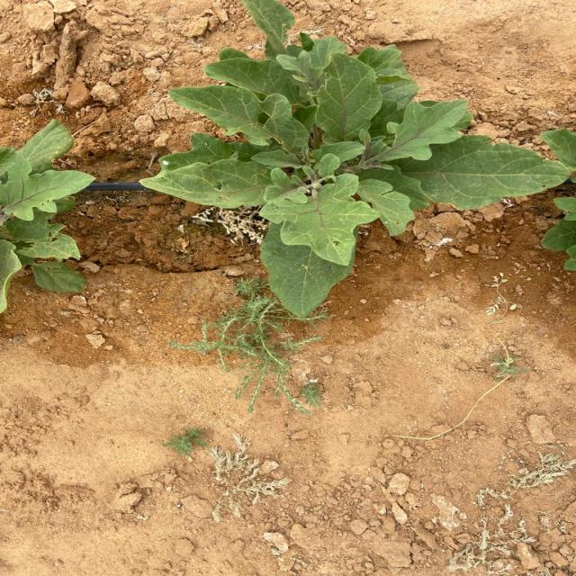
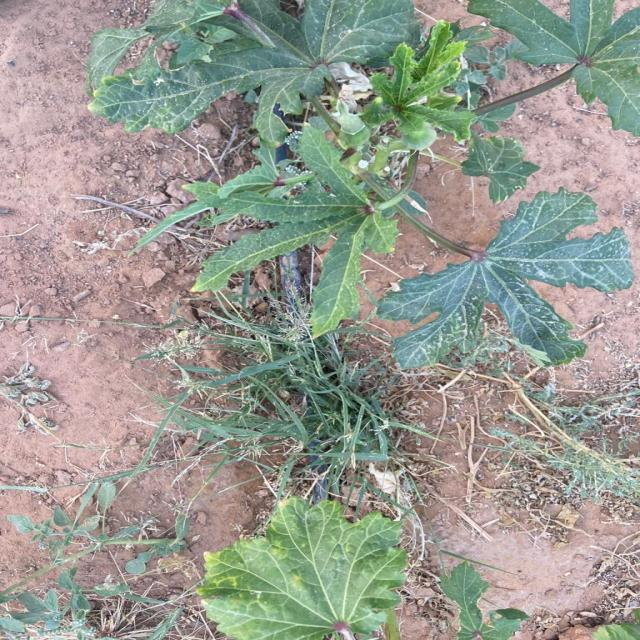

# Deep-Learning-Techniques-for-Weeds-Detection


## Table of Content
* [Introduction](#Introduction)
* [Environment Requirements](#Environment-Requirements)
* [Dataset](#Dataset)
* [Model Architecture](#Model-Architecture)
* [Model Training](#Model-Training)
* [Conclusion](#Conclusion)

# Introduction  
Weeds pose a significant threat to agricultural productivity, causing yield losses and increasing the need for herbicides. Traditional weed detection methods are time-consuming and labor-intensive, making them inefficient for large-scale farming operations. In recent years, deep learning techniques have shown promising results in various computer vision tasks, including object detection. This project aim to use deep learning models to detect weeds, compare their performance, and provide additional analysis using a newly created dataset

### Research objectives: 
The present study investigates the following objectives:

* Evaluate the performance of the models and compare the results. 
* Build a dataset from agricultural fields for additional analysis.

# Environment Requirements:

* gitpython>=3.1.30
* opencv-python>=4.1.1
* torch>=1.8.0
* torchvision>=0.9.0
* Pillow
* matplotlib
* pandas
* seaborn
* Google Colab Pro
* Roboflow


# Dataset
In this project, we used an open-access [Weeds and Corn dataset from Roboflow](https://universe.roboflow.com/secomindai/weeddetection-kvotz) . This dataset includes manually annotated images that can be employed to detect weeds. The dataset consist of 1,268 RGB images divided into two classes: weeds and corn images. The dataset has been annotated with bounding box annotations. Through augmentation, the dataset has been expanded to contain 3042 instances, with each training example having three outputs. Specifically, for the "crop" class, maximum zoom of 20%, minimum zoom of 0%, and rotations ranging from -15° to +15° have been applied. We changed the distribution ratio if the sets into 80% training set, 10% validation set, and 10% test set.

### Dataset Reference
```
@misc{ weeddetection-kvotz_dataset,
    title = { WeedDetection Dataset },
    type = { Open Source Dataset },
    author = { Secomindai },
    howpublished = { \url{ https://universe.roboflow.com/secomindai/weeddetection-kvotz } },
    url = { https://universe.roboflow.com/secomindai/weeddetection-kvotz },
    journal = { Roboflow Universe },
    publisher = { Roboflow },
    year = { 2022 },
    month = { aug },
    note = { visited on 2023-10-08 },
}
```

## New Dataset
We expanded our analysis by evaluating the performance of YOLOv7 on a newly collected dataset, specifically captured from Okra and Eggplant fields. The dataset consists of 3 classes (Okra, Eggplant, Weeds) and 950 images captured by an iPhone 11 Pro and iPhone 12 Ultra Wide camera from May 16th to 18th, 2023. The data was collected between 11 AM and 7 PM, including various weather and light conditions. You can find sample images in this folder [images](src/images/) 








### Prepare and Label image data:
We used the advanced Smart Polygon feature in Roboflow Annotate, which is powered by the Segment Anything Model (SAM). This cloud-based solution allowed us to apply polygon annotations with improved speed, ease, and precision directly within the Roboflow UI. To prepare each image for analysis, pre-processing steps were performed, including autoorientation of pixel data by stripping EXIF-orientation and resizing to 640x640 dimensions using stretch transformation. A set of augmentation techniques was applied to generate two versions of each source image. These techniques included a 50% probability of horizontal flip, a 50% probability of vertical flip, random rotation within the range of -15 to +15 degrees, and random shear horizontally and vertically within the range of -15°to +15°. As a result of these augmentations, the total number of images in the dataset increased to 1596.

# Model Architecture
YOLO model considered as a One-stage object detectors, In this project we trained different versions of the real-time object detection YOLO models (YOLOv5, YOLOv6, YOLOv7, and YOLOv8). These YOLO models apply a single neural network to the full image as shown in below Figure. 


# Model Training
The training procedure for all YOLO models that we train follows a standardized approach with the following hyperparameters: 100 epochs, batch size of 16, and an image size of 640 pixels.

Additional hyperparameters such as the learning rate, weight decay, optimizer choice, and augmentation techniques are set to their default values. It should be noted that the chosen YOLO detectors have open-source software packages that were created by their developers. These software packages, as summarized in below Table, were utilized in this project to train weeds dataset. 
  | YOLO Version | URL
------------- | -------------
YOLOv5s  | https://github.com/ultralytics/yolov5
YOLOv6  | https://github.com/meituan/YOLOv6 
YOLOv7  |   https://github.com/WongKinYiu/yolov7
YOLOv8s  |  https://github.com/ultralytics/ultralytics

The commands below reproduce YOLO versions training:
```bash 
# YOLOv5
%%time
%cd /content/yolov5/
!python train.py --img 640 --batch 16 --epochs 100 --data {dataset.location}/data.yaml  --weights yolov5s.pt --name yolov5s_results  --cache
```

```bash
# YOLOv6
!python tools/train.py --batch 16 --conf configs/yolov6s.py --epochs 100 --img-size 640 --data {dataset.location}/data.yaml --device 0 
```

```bash
# YOLOv7
%cd /content/yolov7
!python train.py --batch 16 --epochs 100 --data {dataset.location}/data.yaml --weights 'yolov7_training.pt' --device 0 
```
```bash
#YOLOv8
%cd {HOME}

!yolo task=detect mode=train model=yolov8s.pt data={dataset.location}/data.yaml epochs=100 imgsz=640 plots=True
```

# Evaluation

In the training step, all models achieved an mAP greater than 90 and YOLOv7 outperformed all versions. Below figure show the training curve of mAP@0.5 for YOLOv5, YOLOv6, YOLOv7, and YOLOv8


We evaluate the performance of each model on the validation set by using below commands: 
```bash
# YOLOv5
%%time
%cd /content/yolov5/
!python val.py --batch 16 --data {dataset.location}/data.yaml  --weights /content/yolov5/runs/train/yolov5s_results/weights/best.pt  
```

```bash
# YOLOv6
!python tools/eval.py --data {dataset.location}/data.yaml --img-size 640 --weights runs/train/exp/weights/best_ckpt.pt --device 0 

```

```bash
#YOLOv7
!python test.py --batch 16 --weights /content/yolov7/runs/train/exp/weights/best.pt --data /content/yolov7/corn-2/data.yaml  --task val --name yolo_val

```

```bash
#YOLOv8
%cd {HOME}
!yolo task=detect mode=val model=/content/runs/detect/train/weights/best.pt data={dataset.location}/data.yaml epochs=100 imgsz=640 plots=True
```

### Validation results on Open-source Dataset

| Index | YOLO versions | Precision | Recall | mAP@0.5 | mAP@[0.5:0.95] |
| :--- | :--- | :--- | :--- | :--- | :--- |
| 1 | YOLOv5s | 0.954 | 0.969 | 0.986 | 0.711 |
| 2 | YOLOv6 | 0.592 | 0.677 | 0.963 | 0.565 |
| 3 | YOLOv7 | **0.97** | 0.968 | **0.992** | **0.75** |
| 4 | YOLOv8s | 0.941 | **0.974** | 0.988 | 0.745 |


### Validation results on Our Dataset

| Class | Precision | Recall | mAP@0.5 | mAP@[0.5:0.95] |
| :--- | :--- | :--- | :--- | :--- | 
| all | 0.97 | 0.982 | 0.994 | 0.785 |
| weeds | 0.964 | 0.964 | 0.994 | 0.764 |
| corn | 0.977 | 0.981 | 0.994 | 0.807 |


# Conclusion

* Our study evaluated and compared different versions of YOLO model.

* The findings indicated that YOLOv7 outperformed other models, showcasing its better performance based on mAP.

* Collect new dataset from okra and eggplant fields. Retrain best model with on our dataset.
